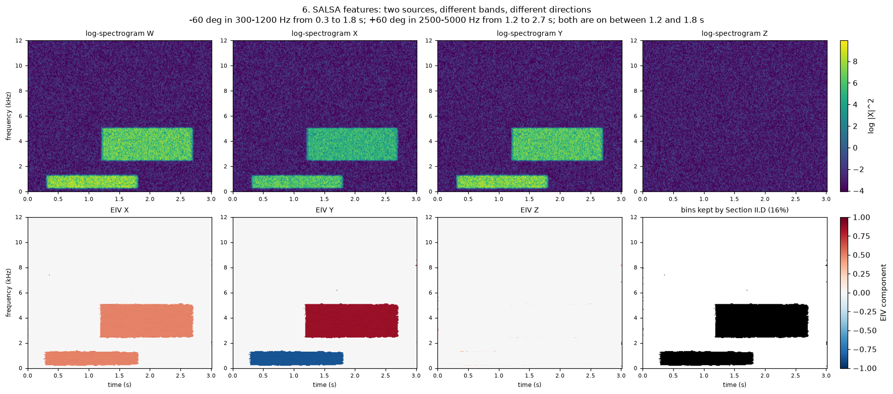
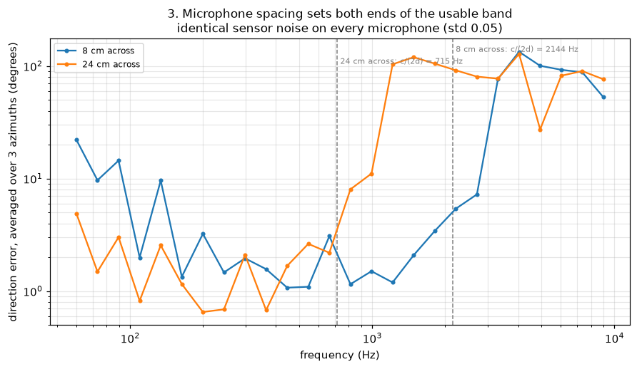
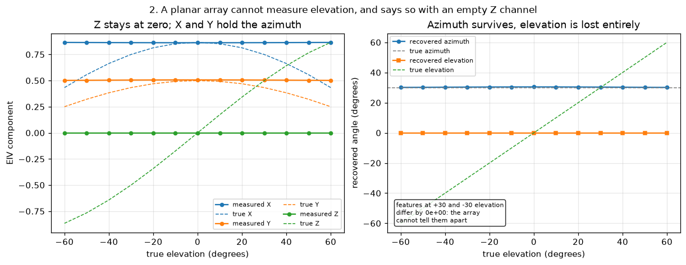
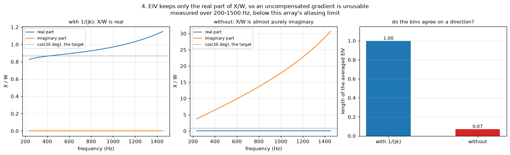
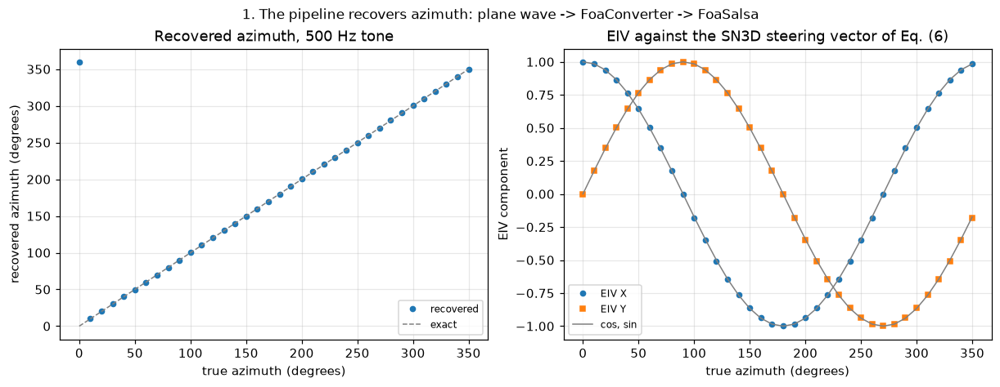
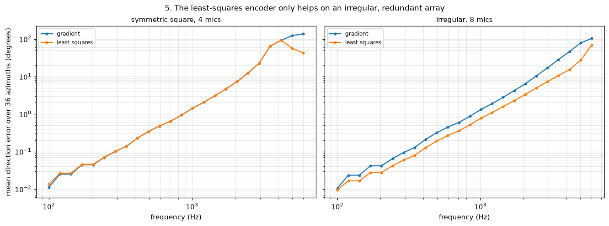
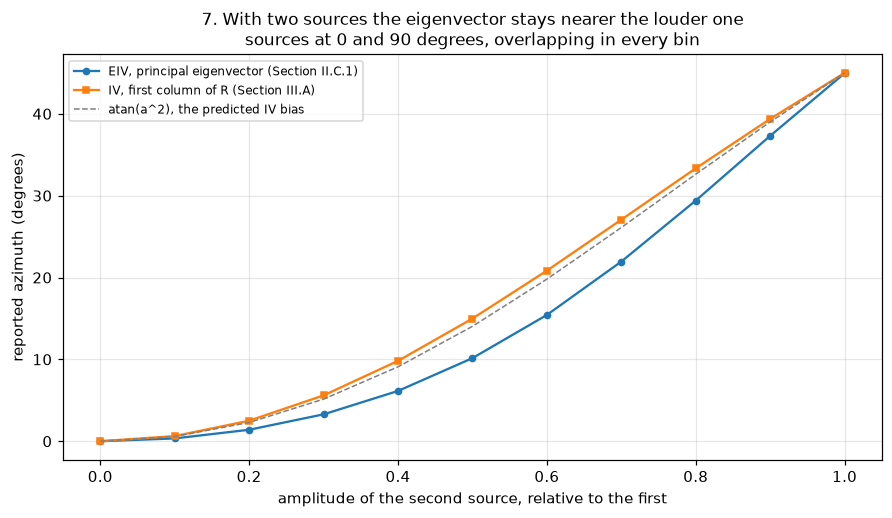
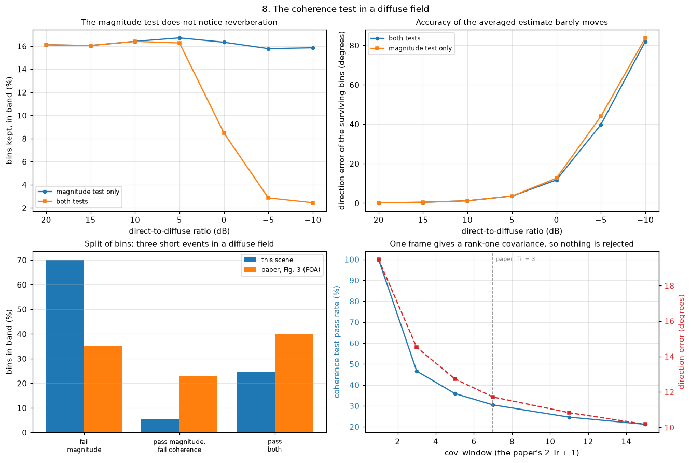

# foasalsa

SALSA features for first-order ambisonics, plus the MIC-to-FOA conversion.

**Scope.** This is a complete implementation of the FOA branch of the SALSA
feature extraction (paper Section II) together with a converter from an
arbitrary array of omnidirectional microphones into FOA. Deliberately out of
scope: the parametric encoding of McCormack et al. and the SELD network,
augmentations and challenge metrics of SALSA Sections III to VI.



---

## References

**SALSA** — Nguyen, Watcharasupat, Nguyen, Jones, Gan, *"SALSA: Spatial
Cue-Augmented Log-Spectrogram Features for Polyphonic Sound Event Localization
and Detection"*, IEEE/ACM TASLP vol. 30, 2022.
[arXiv:2110.00275](https://arxiv.org/abs/2110.00275) ·
[authors' code](https://github.com/thomeou/SALSA)

What we take from it: Section II in full, which defines the feature — the
signal model (1), the log-linear spectrograms (2), the covariance estimate (5),
the FOA steering vector (6), the magnitude test (9), the decomposition (10) and
the coherence test (11). Also Section V.C, which lists the STFT settings, and
Section V.A, which gives the frequency band. Nothing from Sections III, IV or
VI.

**Ambisonic encoding** — McCormack, Politis, Gonzalez, Lokki, Pulkki,
*"Parametric Ambisonic Encoding of Arbitrary Microphone Arrays"*, IEEE/ACM
TASLP vol. 30, 2022.
[PDF](https://leomccormack.github.io/sparta-site/docs/help/related-publications/mccormack2022parametric.pdf)

What we take from it: Section II only, which is the conventional linear
signal-independent encoding. Its equation (2),

```
E(f) = Y W A^H(f) [V D(f) + beta I]^-1,   D(f) = (1/V) A(f) W A^H(f)
```

is our `mode="ls"` encoder. With a uniform direction grid `W = I`, so
`V D(f) = A(f) A^H(f)` and the expression reduces to what the code implements.
We also follow its recommendation to find the upper usable frequency of an
irregular array empirically, by sweeping frequency, rather than from a formula.
Nothing from Sections IV to VI, which are the parametric method.

---

## Install and run

```bash
python -m venv .venv && source .venv/bin/activate
pip install -e ".[examples]"

python -m foasalsa.examples plots/
pytest
```

`uv venv && uv pip install -e ".[examples]"` works too and is faster.

The core package depends on torch alone. Matplotlib is an optional extra
because only the example figures draw anything; the command above installs it,
so there is no second step. The figures are committed under `plots/`, so the
rest of this README can be read without running anything.

---

## Usage

```python
import torch
from foasalsa import FoaConverter, FoaSalsa

mics = torch.tensor([            # [C, 3] positions in metres, any C >= 3
    [ 0.05,  0.00, 0.0],
    [ 0.00,  0.05, 0.0],
    [-0.05,  0.00, 0.0],
    [ 0.00, -0.05, 0.0],
])
audio = torch.randn(2, 4, 24000) # [N, C, T]

foa = FoaConverter().convert(audio, mics)  # [N, 4, T]   W, X, Y, Z, SN3D
features = FoaSalsa().compute(foa)         # [N, 7, F, T_frames]
```

The seven output channels are the two halves of Section II:

| Channels | Contents |
|---|---|
| 0-3 | `log(abs(X)^2)` for W, X, Y, Z — equation (2) |
| 4-6 | normalised principal eigenvector, the EIV — Section II.C.1 |

The task statement writes both the input and output time axis as `T`. They are
not the same unit: the input counts audio samples, the output counts STFT
frames, which the paper's settings put at 80 per second. We kept the letter as
given and say so in the docstring.

## How it works

```
[N, 4, T]  audio
    |  STFT                                       Section V.C settings
[N, 4, F, T_frames]  complex
    |
    +--> log(abs(X)^2)  ------------------------> channels 0-3   eq. (2)
    |
    +--> R = average of X X^H over 7 frames       eq. (5)
             |
             +--> principal eigenvector u         eq. (10)
             |        |  divide by the W element, take the real part,
             |        |  normalise to unit length
             |        +-------------------------> channels 4-6   II.C.1
             |
             +--> sigma1 / sigma2 -> coherence test    eq. (11)
                  running RMS vs noise floor -> magnitude test   eq. (9)
                         |
                         +-> zero every bin that fails either test, and
                             everything outside 50 Hz - 9 kHz
```

---

## Assumptions

These are not four independent choices. Each one follows from the one before.

### The capsules are omnidirectional

The input is `[C, 3]` coordinates and nothing else — no directivity
information. So we assume the simplest thing: every capsule measures pressure,
a scalar with no direction in it.

This matters more than it looks, because the capsule type decides how much
direction is already present in a single channel:

| Capsule | Measures | Direction in one channel |
|---|---|---|
| Omnidirectional | pressure | none |
| Figure-of-eight | velocity along one axis | all of it, for that axis |
| Cardioid | pressure plus some velocity | partial |

A single figure-of-eight capsule is already an X, Y or Z channel. Because ours
are omnidirectional, **all** the direction has to come from the microphones
being in different places. That is not a separate decision; it follows from the
first one.

### The sources are far away

Plane waves in a free field, which is the model of equation (1). For a distant
source the level difference between microphones is small, and the useful cue is
almost entirely the difference in arrival time. That is what `synth.py`
generates.

### A pressure difference is a gradient

This one is separate, and it is purely about frequency. Omnidirectional
capsules give differences always. For a difference to mean the slope of the
field, the wavelength has to be much longer than the array. Section
[Limitations](#limitations) is about what happens when it is not.

### SN3D is a scaling convention

Not physics, just an agreement about numbers. For a unit plane wave the SN3D
steering vector is `[1, cos(phi)cos(theta), sin(phi)cos(theta), sin(theta)]`,
which is equation (6) of the paper.

One number worth stating because it is easy to copy wrongly: in SN3D,
`|W|^2 = |X|^2 + |Y|^2 + |Z|^2` for a plane wave. The factor of one half that
often appears in ambisonic energy formulas comes from FuMa, where `W = p/sqrt(2)`,
and does not belong here.

---

## Limitations

### The upper limit is the gradient assumption breaking

Three statements that sound different but are the same thing:

1. "a difference is a gradient" stops being true once the wavelength is
   comparable to the array size,
2. that is spatial aliasing,
3. that is the upper frequency limit of the method.

This is a property of the geometry, not of the code. Above it the phase between
two microphones is ambiguous and no encoder can recover the direction.



For a free-field array of omnidirectional capsules the usual marker is
`c / (2 d)`, with `d` the largest distance between two microphones. Measured
against our own arrays, that marker is where the error **starts to grow**, not
where the estimate falls apart — the mean error passes 30 degrees at about
twice the marked frequency, consistently:

| Array | `c / (2 d)` | measured collapse | ratio |
|---|---|---|---|
| 8 cm across | 2144 Hz | 4172 Hz | 1.95 |
| 10 cm across | 1715 Hz | 3188 Hz | 1.86 |
| 24 cm across | 715 Hz | 1406 Hz | 1.97 |

So we treat `c / (2 d)` as a conservative onset marker and determine the real
limit by sweeping frequency, which is what McCormack et al. recommend for
irregular arrays.

**About the paper's 9 kHz.** It is tempting to read the SALSA band limit as an
aliasing frequency. It is not. Section V.A says the 32-channel Eigenmike
signals were converted to FOA, "whose array response is approximately
frequency-independent up to around 9 kHz". The aliasing number in that paper is
a different one, 4 kHz, and it is quoted for the MIC format instead. Both
belong to a baffled spherical array and neither transfers to a free-field
planar array of omnidirectional capsules. `fmax` defaults to the paper's 9 kHz
for fidelity to the reference, but a different array needs a different value.

**A consequence of keeping the full frequency axis.** The output has
`F = n_fft/2 + 1 = 257` bins, and the mask only zeroes what fails the two tests
of Section II.D or falls outside `[fmin, fmax]`. For the 10 cm array in the
examples, everything above roughly 1.7 kHz is past the onset marker, so those
EIV bins are present in the output but carry no reliable direction. They are
there because the contract asks for `[N, 7, F, T]`, not because they are
informative. Lower `fmax` to suit the array in use.

### The lower limit is the same geometry from the other side

At low frequency the differences between microphones are tiny. Recovering a
direction from them means amplifying, and that amplifies microphone noise with
it. This is what `max_gain_db` bounds.

So the trade-off runs both ways: a wider array is more accurate low down,
because the phase differences it works with are larger, and fails sooner up
top. The figure above shows both halves. Showing the lower half required adding
sensor noise, because without noise the wider array has no visible advantage
anywhere.

### A planar array cannot measure elevation

Every microphone has `z = 0`, so the third column of the geometry matrix is
zero, the third row of its pseudoinverse is zero, and the Z channel is exactly
zero. Sources mirrored about the horizontal plane produce identical features —
measured difference `0.0`, not merely small.



The code says this with an exact zero rather than amplified noise. Near-planar
geometries are handled by the `rtol` cutoff in the pseudoinverse, so a tenth of
a millimetre of numerical dust on the z axis does not become a Z channel.

---

## Decisions

### Channel order is W, X, Y, Z

As in equation (6). Note that the DCASE and TNSSE datasets use ACN ordering,
`W, Y, Z, X`, so feeding those in requires a permutation first. We chose the
paper's ordering because it makes the link between `FoaConverter` and
`FoaSalsa` direct.

### Both encoders are narrowband, and here is why

A genuinely broadband encoder exists: one fixed matrix applied in the time
domain, no STFT. We do not use it, and the reason is not aliasing.

A finite difference between omnidirectional capsules measures `grad(p)`, and
for a plane wave `grad(p) = -j k p`. The direction is right but the result is
90 degrees out of phase with W, and its magnitude rises with frequency. SALSA's
EIV divides XYZ by W and keeps the real part — and the real part of an almost
purely imaginary ratio is rounding error. Normalising that to unit length turns
the error into a confident direction pointing nowhere.



Averaging unit vectors that agree gives a vector of length 1; averaging vectors
pointing at random gives nearly 0. Measured over 200-1500 Hz: **1.00 with the
compensation, 0.07 without**.

The information is not destroyed, only moved somewhere the EIV does not look.
The angle of `X/W` is a clean constant: 0 degrees with the compensation,
exactly -90 without. A feature reading the
angle would see an offset it could subtract — which is what SALSA does for the
MIC format, where the EPV of Section II.C.2 takes the phase of the same ratio.
So the failure belongs to the pairing of a quadrature gradient with a
real-part reader, not to spatial features in general.

The `1/(jk)` factor that fixes this is frequency-dependent by definition, so it
forces the STFT. Both of our encoder modes are therefore narrowband, and the
only difference between them is how `E(f)` is built at each frequency:

| Mode | How `E(f)` is built |
|---|---|
| `gradient` (default) | linearise `exp(jkr)` to `1 + jkr`, then average plus pseudoinverse of the geometry |
| `ls` | exact `exp(jkr)` over 642 directions on a Fibonacci sphere, solved by least squares — McCormack equation (2) |

**What the STFT does and does not do.** It does not remove the upper limit. It
lets us replace a crude approximation with an exact per-frequency formula, and
so move the practical limit closer to the physical one. The gradient encoder
runs out earlier not because its physics is worse, but because it uses the
low-frequency approximation at every frequency. The physical limit — where the
phase between microphones becomes ambiguous — is the same for both, and no
amount of transform fixes it.

A pleasant consequence: `gradient` is not a cheap substitute for `ls`, it is
its exact low-frequency limit. At 94 Hz the two matrices agree to a relative
difference of **7.4e-4**; the gap grows to 2.2e-2 at 500 Hz and 4.0e-1 at 4 kHz.

### Three ways to take the decomposition

`method` selects between `eigh` (default), `svd` and `power`. All three produce
the same features to within `1e-4`; they differ in cost and in what they need
from the platform. Numbers in [Findings](#findings).

All three are handed the symmetrised matrix, `R = (R + R^H) / 2`. The
covariance is Hermitian by construction, but summing seven complex products
leaves the two triangles differing in the last digits, and `torch.linalg.eigh`
reads only one triangle. This is not a hypothetical: mutation testing showed
that putting `100` into the upper triangle changes nothing at all without the
symmetrisation, which is exactly the silent data loss it prevents.

### What we took literally, and what we decided ourselves

| From the paper | Value |
|---|---|
| Sample rate, window, hop, FFT size (V.C) | 24 kHz, 512, 300, 512 |
| Band limits (V.A) | 50 Hz to 9 kHz |
| Covariance window (5) | `cov_window = 7`, which is the paper's `2 Tr + 1` with `Tr = 3` |
| Magnitude threshold (9) | `alpha_snr = 1.5` |
| Coherence threshold (11) | `beta_drr = 5` |

| Our choice | Why |
|---|---|
| `noise_floor_rise = 1.02`, `noise_floor_fall = 0.98` | Section II.D describes the tracker in words — "slightly increased or decreased" — and notes other estimators would do. These are the simplest multipliers matching that description. |
| Repeat edge frames when averaging the covariance | Zero padding would make the first and last few frames quietly quieter. |
| No frequency-band compression above 9 kHz | Section V.C compresses bands to reach `F = 200` for the network input. The contract here asks for `[N, 7, F, T]`, so the output keeps the full 257 bins. |
| `eps` guards on both divisions in the EIV | Not specified in the paper. A bin whose real part vanished returns zeros rather than a unit vector built from rounding error. |

---

## Findings

### The pipeline recovers the direction it was given



A 500 Hz tone from every azimuth in turn, through `plane_wave` →
`FoaConverter` → `FoaSalsa`. Worst error over the full circle: **0.50 degrees**.
This is the baseline the other examples break on purpose.

### The least-squares encoder only helps on an irregular, redundant array



This was the biggest surprise. On a symmetric array the two encoders give
**identical** directions at every frequency, differing only by an overall gain
that normalising removes. Symmetry means X can only be built from one opposing
pair of microphones and Y from the other, so there is nothing else for the
encoders to disagree about.

We checked how far this holds: regular polygons with 4, 6 and 8 microphones,
with and without sensor noise, all give agreement to the last digit. The claim
is limited to that setting — regular polygons, free-field omnidirectional
steering — but within it the two encoders are not merely close, they are the
same. The least-squares fit starts to pay only when the array has both
redundancy and no symmetry. On eight irregular coplanar microphones:

| Frequency | `gradient` | `ls` |
|---|---|---|
| 250 Hz | 0.03 deg | 0.02 deg |
| 500 Hz | 0.10 deg | 0.05 deg |
| 1 kHz | 0.43 deg | 0.17 deg |
| 2 kHz | 2.09 deg | 1.05 deg |
| 3 kHz | 8.23 deg | 5.22 deg |

Useful only in the middle: at the bottom the encoders have converged, at the
top the geometry has run out of information.

### The eigenvector follows the louder source; the cross-spectrum averages



This is the paper's central claim, on synthetic data. The baseline of Section
III.A and the feature of Section II.C.1 come from the same covariance matrix —
the baseline reads its first column, SALSA takes its principal eigenvector.

With two sources in the same bins the first column returns
`sigma1^2 H1 + sigma2^2 H2`, a weighted sum pointing at neither source. With a
second source at half amplitude, that predicts a bias of `atan(0.25) = 14.0`
degrees, and the measured value is **15.0**. The eigenvector approximates the
dominant steering vector instead and lands at **10.2** degrees.

### Averaging the covariance is what makes the coherence test possible

A single frame gives `R = X X^H`, which is rank one by construction whatever
the scene contained. Its second eigenvalue is zero everywhere, so the coherence
test of equation (11) passes every bin. With `cov_window = 1` on a three-source
scene the mask keeps the whole passband; with `cov_window = 7` it keeps under
half of it. The seven-frame average is not smoothing, it is what gives the test
something to measure.

### `eigh` is the cheapest of the three, and power iteration is the most expensive

On a one-second scene, 257 by 81 bins:

| Method | Time |
|---|---|
| `eigh` | 18 ms |
| `svd` | 39 ms |
| `power`, 8 iterations | 49 ms |

The opposite of what its use of plain batched matmuls suggests. Eight
iterations plus a deflation pass is sixteen passes over the tensor, while
`eigh` does one pass in LAPACK. Power iteration earns its place by being
differentiable and needing no LAPACK, not by being fast.

Its accuracy has a caveat worth stating. Convergence goes as
`(sigma2/sigma1)^n`, so on a crowded scene the worst bins are still wrong after
a dozen iterations. But a low `sigma1/sigma2` ratio is exactly what the
coherence test rejects, so on the bins that survive the mask the error falls by
about a factor of ten per iteration — `1.5e-1` after one, `8.2e-7` after eight.
The weak case is one whose answer is discarded.

### The coherence test earns its threshold only against reverberation



Every other example here has a clean direct source, so `beta_drr = 5` never
has to do anything. This one adds an isotropic diffuse field — 64 uncorrelated
plane waves from all over the sphere, the standard stand-in for a reverberant
tail — and sweeps the direct-to-diffuse ratio.

The magnitude test turns out to be **blind to reverberation**. Diffuse energy
is still energy, so its pass rate barely moves, staying near 16% of in-band
bins from +20 dB down to -10 dB. The coherence test does all the work,
dropping from 16% to under 3%.

What it does *not* do is rescue the averaged direction. At -5 dB, averaging the
surviving bins gives 40 degrees of error against 44 without the test. Averaging
thousands of bins already suppresses most of the damage. The value is
elsewhere: the feature handed to a network has 85% fewer bins claiming a
direction they do not have, and a network reads each bin separately.

The same figure puts numbers on two things that were otherwise only asserted.
The `cov_window` sweep shows the pass rate starting at 100% for a one-frame
covariance — rank one by construction, `sigma2 = 0`, nothing to reject — and
falling to 30% at the paper's `Tr = 3`. And the three-way split of bins is
compared against Fig. 3 of the paper:

| | this scene | paper, Fig. 3 (FOA) |
|---|---|---|
| fail magnitude | 70% | 35% |
| pass magnitude, fail coherence | 5% | 23% |
| pass both | 25% | 40% |

These do not agree, and the reason is worth stating rather than tuning away.
The paper measures a dataset of dense real recordings; this scene is three
short events in silence, so far more bins here are simply empty. The synthetic
diffuse field also has no early reflections, which is what produces most of the
middle category in a real room.

### Smaller things

**W droops before XYZ do.** At 500 Hz on a 10 cm array the pointing error is
under a degree, but W has fallen to about 0.95 — it is the average of
microphones that no longer agree, and that average acts as a spatial low-pass.
SALSA never sees this because the EIV normalises to unit length, but it is
audible if the FOA is played back.

**Reverberation is modelled, rooms are not.** `diffuse_field()` is a sum of
plane waves from every direction. It reproduces the one property the coherence
test reacts to — a covariance that is no longer close to rank one — but it has
no walls, no early reflections and no frequency-dependent absorption. A real
room would exercise the middle category of the split above far harder.

**The noise floor is a tracker, so a steady source becomes background.** It
creeps towards whatever does not change, which means a source that never stops
eventually stops passing the magnitude test. That is correct behaviour for a
feature built to find sound *events*, and it is why both sources in the
features figure switch on and off.

**The covariance normalisation is invisible downstream.** Equation (5) divides
by the window size, and mutation testing showed that removing the division
breaks nothing: scaling `R` by a constant scales both eigenvalues equally, so
the eigenvector, the EIV and the `sigma1/sigma2` ratio are unchanged. It is
correct to keep it, and it needs its own test because no feature test covers it.

---

## Tests

243 tests, run with `pytest`. They cover both encoders, all three decomposition
methods, the feature extractor, the synthetic fixtures the other tests rely on,
and that every figure renders.

The suite was checked by mutation. Two mutations survived the first round, and
both turned out to be properties of the code rather than gaps in the tests: the
covariance normalisation has no effect downstream, and `eigh` ignores the upper
triangle, which is what the symmetrisation is for.

---

## Out of scope

**The parametric part of McCormack et al.** (Sections IV to VI): spatial
covariance whitening, MUSIC, source-number estimation, LCMP beamforming and
diffuse rendering. That is a signal-*dependent* encoder and a much larger piece
of work. It would extend usable bandwidth further than the least-squares
encoder does, and it is the natural direction if this were to grow.

**The SELD half of SALSA** (Sections III, IV and VI): the CRNN, the data
augmentations and the DCASE evaluation metrics. This package produces features,
not predictions.

**The MIC-format branch of SALSA** (Section II.C.2): the eigenvector-based
phase vector, which stacks `M` spectrograms with `M-1` EPV channels. The task
asks for the FOA branch, and the two share the covariance and decomposition
code, so adding it would mostly be a different normalisation of the same
eigenvector.
